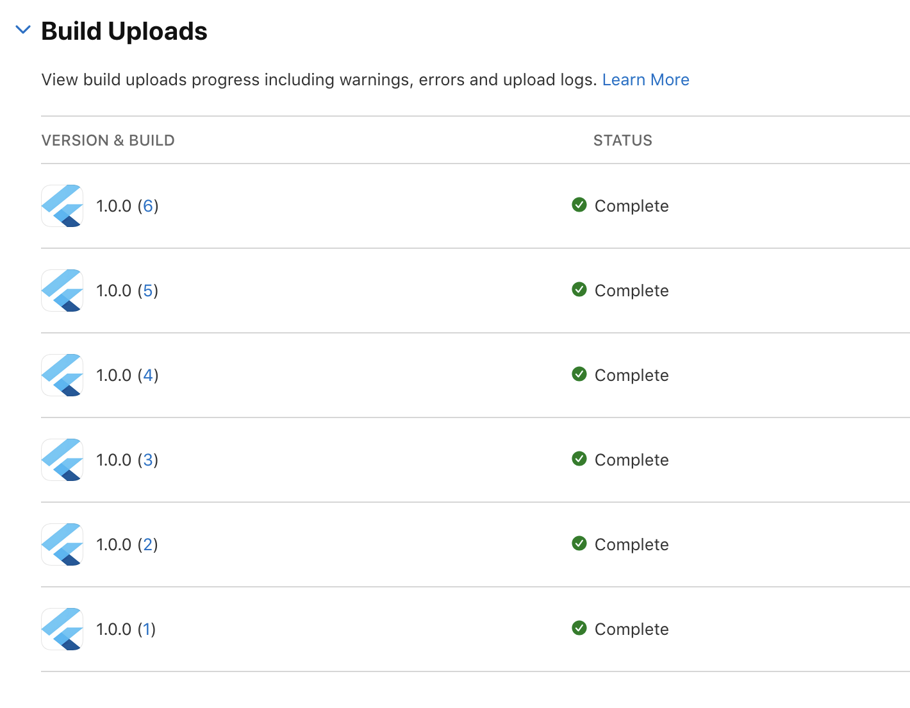
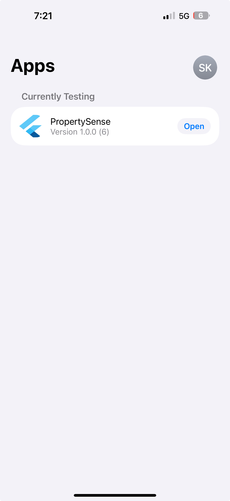
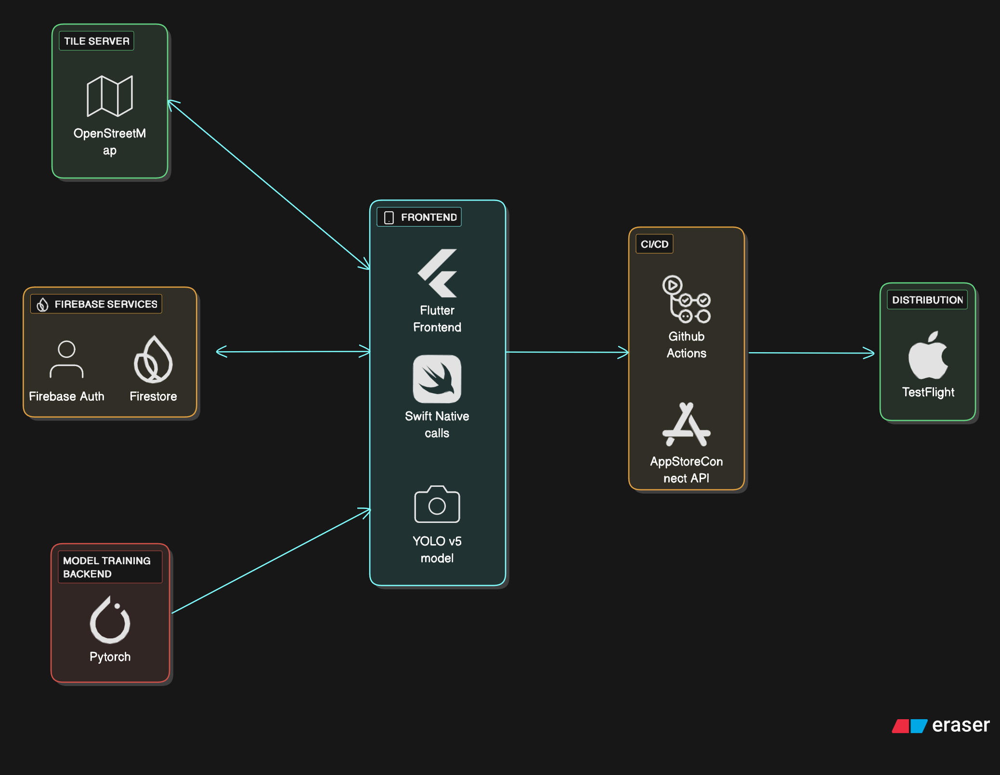

# FINAL PROJECT: Software MVP for PropertySense
# 1. Product Overview
## TL;DR
PropertySense AI is a home-repair platform that diagnoses issues from photos, provides instant AI-generated cost estimates, and connects homeowners with verified contractors who bid transparently on the job. By combining visual analysis and upfront pricing, PropertySense AI removes guesswork, reduces risk, and streamlines the repair process from problem discovery to job completion.
## Key Jobs To Be Done
- As a homeowner noticing a problem in my house, I want to take photos of the issue and get an AI-generated diagnosis with a repair cost estimate, so I can understand the problem before contacting a professional.
- As a homeowner needing quick repair service, I want to receive offers from verified contractors nearby who can fix the issue for the estimated price, so I can book a repair easily and confidently.
- As a licensed contractor or repair professional, I want to view available nearby repair requests with AI-generated summaries and cost ranges, so I can choose jobs that fit my skills and schedule.
## Core Critical User Journeys (Overview)
### CUJ 1: AI-Powered Issue Detection and Cost Estimation 
**Scenario**: The homeowner captures and uploads photos of a home issue to receive an instant AI analysis.
- The user opens the app on their phone.
- The user selects “New Repair Estimate” and uploads or captures photos of the issue (e.g., leaky pipe, cracked wall).
- The AI model analyzes the image to identify issue type and severity.
- The system provides an estimated repair cost range, description of the detected issue, and possible causes.
- The user can save or proceed to “Find a Contractor.”

### CUJ 2: Contractor Matching and Job Posting 
**Scenario**: The homeowner wants to connect with verified contractors to fix the identified issue.
- From the AI results page, the user selects “Find a Contractor.”
- The system automatically creates a repair job listing with photos, issue summary, and estimated budget.
- Verified contractors nearby receive the job request on their app, along with the AI’s estimate and image set.
- Contractors review the photos, verify the issue, and submit their own offers.
- The homeowner receives multiple offers with contractor profiles, ratings, and proposed prices.
- Homeowner compares offers and confirms a booking directly through the app.

### CUJ 3: Contractor Workflow and Job Completion
**Scenario**: A verified contractor accepts a repair job, completes the work, and both parties confirm the completion through the app.
- From the map view, the contractor browses nearby available repair listings created by homeowners.
- The contractor opens a listing, reviews the AI-generated issue summary and estimated cost, and decides to accept the job.
- Once the homeowner confirms the booking, the contractor completes the assigned repair job.
- The contractor opens the job and marks it as “Completed by Me” and the system sends a notification to the homeowner to review the finished job.
- The homeowner reviews the work and sets the listing as “Completed,” triggering automatic payment processing.
- Both parties receive a receipt, and the option to rate each other.

# 2. MVP Development Justification
## Initial Hypothesis
Our initial project concept focused on the problem of inaccurate property valuations. This idea stemmed from the limitations of tools like Zillow, particularly its lack of Canadian support, and the inconsistency observed in alternative Canadian valuation tools. We believed that homeowners, especially those preparing to sell, needed faster and more accurate valuations, and that incorporating photo-based analysis could provide a competitive advantage. The resulting working hypothesis was that the primary job-to-be-done for users was “Help me understand the real value of my home before selling.”

At this stage, we assumed that valuation accuracy was the central pain point and that homeowners would value a platform capable of analyzing images to assess renovations, property conditions, and visual features often overlooked by automated valuation models. This framed our initial direction toward building an AI-enhanced property valuation system.

## Key Learnings and Pivots
### Reassessment After Competitor Testing
Our CUJ evaluation of tools such as Masterkey, Zillow, Zolo, and Wahi revealed substantial barriers that challenged the feasibility of our initial hypothesis. Zillow’s regional restriction to the U.S. market made it irrelevant for most Canadian users. Zolo, while available, produced highly inconsistent results, often varying by hundreds of thousands of dollars with no clear explanation. Across all platforms, valuation outputs felt generic and opaque, and none incorporated photo-based analysis. Despite these gaps, it became clear that competing in this space, already dominated by large, data-rich companies, was too broad and technically demanding for a student MVP.

Feedback from our professor and teaching assistant reinforced this realization. The problem was too expansive, and achieving a meaningful improvement in valuation accuracy was unrealistic within the scope of our project. This prompted us to reconsider whether valuation was truly the most meaningful and actionable homeowner pain point.

### Shift Toward Home Repair as the Core Problem
Through further reflection and instructor guidance, we recognized that the challenges faced by homeowners often arise much earlier than the selling stage. Many homeowners struggle with navigating repairs, understanding what is wrong, and determining what a fair price should be. These problems occur frequently, are immediate, and are not well supported by existing platforms.

This insight led to a shift in our working problem statement, from providing accurate home valuations to addressing everyday repair challenges. The revised job-to-be-done became: “Help me understand what is wrong in my home, what it should cost to fix, and how to find someone trustworthy to repair it.” This reframing opened a clearer and more feasible design direction, aligning with genuine user needs and practical MVP constraints.

### Validation Through User Research
Survey results from ten homeowners, including several newcomers, strongly reinforced the decision to pivot toward repair-focused solutions. Participants consistently expressed concerns about being overcharged by contractors, with most rating this fear at the highest levels. This revealed that price transparency is a significant unmet need, and that users seek clear benchmarks before engaging with service providers.

Another major insight was the importance of trust. Most participants identified finding a trustworthy contractor as their top priority, even above securing the lowest price. Verified contractors, in particular, were perceived as more reliable than higher-rated but unverified individuals. This finding validated the importance of prioritizing contractor verification as a core system feature.

In addition, many users reported that their first instinct when facing a home issue is to research the problem and understand typical costs before contacting anyone. This reinforced the need for AI-driven issue recognition and preliminary cost estimation as the entry point to the product experience. Overall, these findings demonstrated that the repair and contractor-matching domain directly aligned with users’ most urgent and recurring challenges.

### Insights From UI/UX Testing
In-person usability testing further refined the scope of our MVP. Testers responded well to the sign-up process and the overall flow of creating a repair listing. However, the testing also revealed usability issues that informed our prioritization decisions. Users expected repair listings to appear immediately upon creation, prompting us to emphasize the importance of an intuitive and responsive auto-refresh mechanism. Testers also wanted clearer feedback before publishing a listing, which led us to incorporate a listing preview step. These adjustments ensured a smoother experience that aligned with users’ mental models and expectations.

## Justification of the Final MVP
The final MVP incorporates only the features that directly address the needs validated through user research and usability testing. The first component is an AI-powered issue identification and cost estimation flow. Users can upload a photo or use their phone to scan their room and capture defects live, receive a clear explanation of the likely issue, and view a fair market price range. This addresses the widespread fear of being overcharged and supports the research-first behavior many users engage in before requesting professional assistance.

The second component is a contractor-matching system that emphasizes verified contractors. By prioritizing verification and clear contractor profiles, the MVP directly responds to the strong user preference for trustworthiness above all else. This approach also aligns with the survey findings that reliable service providers are far more important than minimal cost savings.

Finally, the listing creation and publishing flow supports users in formalizing their repair needs once they feel confident about the issue and price. The improvements derived from UI testing, such as instant listing feedback and a preview step, ensure that the experience is intuitive and mirrors user expectations.

Collectively, these elements form a cohesive and realistic MVP focused on the most impactful user needs: understanding the issue, knowing what a fair price looks like, and finding someone trustworthy to resolve it. By narrowing the scope to these essential features, the project maintains feasibility while delivering meaningful value early in the user journey.

# 3. Functional and Dynamic MVP
The MVP we delivered is fully functional and demonstrates the core workflow of our product across all primary Customer Use Journeys (CUJs). The implementation focuses on enabling end-to-end interaction between homeowners and contractors, supported by AI-powered defect detection and a dynamic listing system. While several UI components operate with pre-seeded or placeholder data, all essential flows are dynamic and operational.
## Dynamic Functionality (Core CUJs)
### CUJ 1: AI Issue Detection and Preparation
The MVP includes fully dynamic AI-driven image analysis features that allow homeowners to understand issues before posting a job:
- Live defect detection from captured or uploaded photos.
- Classification of defects with model confidence values.
- Multiple-defect reporting, where several detected issues are compiled into a generated summary.
- Ability to proceed directly from AI results into creating a repair listing.

These elements reflect the first critical user journey: getting immediate clarity about a home issue.
### CUJ 2: Listing Creation and Contractor Matching
The platform dynamically supports the entire listing creation and matching workflow after AI diagnosis:
- Dynamic listing creation (type, price, title, and description saved to Firestore).
- Listings appear instantly in contractor interfaces with real-time updates.
- earby listing discovery through:
  - a swipe view for rapid browsing,
  - a map view powered by live contractor geolocation,
  - and a listing inbox for structured communication.
- Offer submission from contractors directly on active listings.
- Appointment creation when homeowners accept contractor offers.

This enables the full contractor-matching CUJ to function end-to-end.

### CUJ 3: Contractor Marketplace & Interaction
The marketplace components that contractors rely on are fully dynamic and operational:
- Filtering nearby listings by type and radius (via contractor profile settings).
- Real-time listing updates, ensuring new offers, accepted offers, and appointments sync across both user roles.
- Bid/offer management for both homeowners and contractors within their respective inbox views.
- Cross-role communication flow, allowing both sides to progress through job acceptance and appointment confirmation.

These interactive components demonstrate the core value of connecting homeowners and contractors through live, data-driven workflows.

## Static Elements
While the primary workflows are dynamic, several components within the MVP use placeholder data or limited logic. These include:
- Contractor registration details, such as company name, ID, and verification status, are static and not currently sourced from a backend system.
- Images are not yet attached to listings, and profile photos are static placeholders.
- The “I don’t know” option during listing creation is non-functional and currently decorative.
- Quick estimation buttons in the map view are static; users must enter listing details to submit offers.
- Publishing a listing does not transition it to a private or controlled visibility stat, drafts are automatically treated as public.
- Price estimation for defects, though supported conceptually, is not implemented in the current model output.

These limitations do not affect the execution of core CUJs but represent areas slated for refinement in future iterations.
# 4. Test Coverage
## Overview

Our project uses a comprehensive testing strategy with both **unit tests** and **integration tests** to ensure code quality and reliability. Tests are organized following Flutter's standard testing conventions.

## CI/CD and Coverage

**Latest passing CI with coverage artifacts:** [View latest CI run](https://github.com/dcsil/PropertySense/actions/workflows/unit-test.yaml)

**Code Coverage:** Coverage is tracked and reported in CI/CD. Current coverage is at **68.3%** line coverage across the application. Coverage reports are generated using `flutter test --coverage` and uploaded as artifacts in GitHub Actions.

## Code Quality & Tooling

**Flutter/Dart Stack:**
- **Testing Framework**: `flutter_test` (Flutter SDK) with `mockito` for mocking dependencies
- **Code Generation**: `build_runner` for generating mock classes from interfaces
- **Integration Testing**: `integration_test` (Flutter SDK) for end-to-end testing

**CI (GitHub Actions):**
- Automated test execution on every pull request and push to `main`
- Coverage generation using `lcov` for line coverage reporting
- HTML coverage reports generated and uploaded as downloadable artifacts

## What We Test

### Data Layer (Repositories)
- **AuthRepository**: Authentication state changes, email/password sign-in, Google/Apple sign-in, sign-out, sign-up, password reset, email verification flows
- **UserRepository**: User document creation, fetching, and state management (covered via ViewModel tests)

### Domain Layer
- **Models**: 
  - `DefectDetection`: Constructor validation, cost calculations (min/max/avg), display name generation, cost range formatting
- **Services**:
  - `PricePredictor`: Single defect prediction, batch prediction, total cost aggregation, confidence-based cost calculations

### UI Layer (ViewModels)
- **LoginViewModel**: Email/password validation, authentication flows, Google/Apple sign-in, password visibility toggling, auth state change handling
- **RegistrationViewModel**: Multi-step registration flow, form validation, step navigation, user type selection, address/identification handling, user document creation
- **EmailSignupViewModel**: Email/password signup, validation, password visibility, auth state management
- **ListingsViewModel**: Listing loading, filtering by status, refresh functionality, error handling
- **ProfileHomeownerViewModel**: Profile updates, homeowner details management, sign-out functionality
- **ProfileContractorViewModel**: Profile updates, contractor details management, listing type filters, radius settings, sign-out functionality

### Integration Tests
- **Login Flow**: Complete authentication flow for both homeowner and contractor user types
- **Navigation**: Screen transitions and routing validation
- **Firebase Integration**: End-to-end testing with Firebase emulator for authentication and Firestore operations

## Running Tests

### Run All Unit Tests

To run all unit tests:

```bash
cd object_detect_test
flutter test
```

### Run Specific Test Files

To run a specific test file:

```bash
flutter test test/ui/viewmodels/login_viewmodel_test.dart
```

### Run Tests with Coverage

To generate code coverage reports:

```bash
flutter test --coverage
```

Coverage data will be written to `coverage/lcov.info`. To view a human-readable summary
You can use a coverage viewer tool or parse the `lcov.info` file directly.

### Run Integration Tests

Integration tests require the Firebase emulator to be running and populated with test data:

```bash
# Start Firebase emulator with test data
firebase emulator:start --import=./emulator_data

# In another terminal, run integration tests
cd object_detect_test
flutter test integration_test/
```

## Test Dependencies

The following packages are used for testing:

- **flutter_test**: Core Flutter testing framework (included with Flutter SDK)
- **mockito**: Mocking framework for creating test doubles
- **build_runner**: Code generation tool for creating mock classes
- **integration_test**: Flutter SDK integration testing framework


# 5. Demo Recording and In Class Live Demo

Carol Stuff

# 6. Deployment Documentation
This section provides all deployment instructions for running the application; the same steps are also included in the project’s [README.md](https://github.com/dcsil/PropertySense/blob/master/README.md) file.
### Requirements
- [Flutter](https://docs.flutter.dev/get-started/quick) and relevant requirements (such as xcode-tools)
- [Python](https://www.python.org/downloads/)
- [IOS Simulator/Xcode](https://developer.apple.com/xcode/) if you want to run the simulator

### Setup
1. Clone the [repo](https://github.com/dcsil/PropertySense)
2. In the `object_detect_test` is the actual flutter project. For developing purposes, we suggest you open that directory (rather than the top level dir) in your preferred editor.
3. Install dependencies with `flutter pub get`
4. You can now run the flutter app with `flutter run`. Note that this will automatically run the `main.dart` file, and automatically select the device which you would like to run the flutter app. You can specify this using the `-d` flag.
5. If you are on a mac, we suggest that you use the IOS simulator that comes with XCode. Run `open -a simulator` to run an simulation instance, and then specify this device when running the flutter app.

### Codegen for unit tests
You can generate the classes required for tests using `flutter pub run build_runner build`

### Model Fine-tuning and running the Python backend

**Python Backend**

Separate from the Flutter app, we have the `/backend` directory, which contains Python code to fine tune and deploy YOLO models for use in the flutter app. 

The data for fine tuning the YOLO model is the [Building Defects Detection Dataset](https://github.com/Praveenkottari/BD3-Dataset), which can be downloaded from the linked repo. We use the `augmented` folder inside the dataset, renamed to `data` and placed under `backend`. 

The dataset is not required for model inference to run. It is only required for fine tuning and deploying a new YOLO model.

## Contributing
### Architecture
Following Flutter standards, the dart files containing the app logic is inside the `lib` directory.

We structure the app using an [MVVM architecture](https://docs.flutter.dev/app-architecture/guide).

**Data Layer**

You may find repositories and services(we have none) in `/data`.
For the general interfaces of the data layer, we've made it easy for you to find the methods in [`repositories.dart`](./object_detect_test/lib/data/repos/repositories.dart). This will give you a high level overview of the business logic of the data sources.

The implementations of these repositories can be found in the relevant subdirectories. You may notice some repositories have both local and remote implementations. This is because originally, we made 2 entrypoints `main.dart` and `main_local.dart` where the latter was supposed to be a purely local instance of the app. We suggest that you look at the remote implementations only, as the local implementations weren't used in practice.

**UI Layer**

You can find [widgets](https://docs.flutter.dev/app-architecture/case-study/ui-layer#define-a-view-model) and [viewModels](https://docs.flutter.dev/app-architecture/case-study/ui-layer#define-a-view-model) inside the `/ui` directory.

ViewModels and Screens/Widgets/Views have a 1-to-1 mapping. We aimed to have screens be [`StatelessWidgets`](https://api.flutter.dev/flutter/widgets/StatelessWidget-class.html)(although this didn't always end up happening in practice).

Thus, the business logic for each screen lives in the corresponding viewmodel. You can get a sense of which repositories are dependency injected into the viewmodel when they are instantiated: 
```
ChangeNotifierProvider<RegistrationViewModel>(
    create: (context) => RegistrationViewModel(
    context.read<AuthRepository>(),
    context.read<UserRepository>(),
    ),
```
Certain viewmodels are instantiated at the top level of the [Provider](https://pub.dev/packages/provider) tree, some are instantiated when the screen is called (so we don't use resources on them while we're not at the screen). Please be wary of this when looking for them in `main.dart`

NOTE: For certain screens such as a single step in the registration flow, it doesn't not have it's own viewmodel. The business logic for the whole registration flow is aggregated into a single viewmodel.

**Domain Models**

We define our business entities in `/domain`. They mostly contain firestore conversion methods.
We don't always store data in our firestore the same way they look in the domain models.
From [`user_model.dart`](https://github.com/dcsil/PropertySense/blob/1eb03bee4a0b8ff75c9c00e8872949c2cc61f96b/object_detect_test/lib/domain/models/user_model.dart#L15)
```
  // Assumes that address will always have a corresponding placemark (using geocoding package)
  // We're basically praying that the geocoding PlacemarkFromCoordinates will always return a valid placemark.(Not sure if this is true).
  // Only store geopoint in firestore, but we'll have placemark in memory for easy access to address components.
  final Location location; 
```

**Utils**

In `/utils` we store helpers such as a Result type and Toaster which help display toasts in the UI.

### Deployment
To deploy the app, just run the [Build and Distribute Workflow](https://github.com/dcsil/PropertySense/actions/workflows/firebase-ios-deploy.yaml).
Seriously, that's it!

This will build the flutter ipa, and then deploy it to the app store connect repository which looks something like this:


From there, we can allow specific Testflight groups access to this build, and all testers in a group will be notified.


In theory, we could also submit the app for review for the App Store. However, we have not done this for this project.

### Testing

**Running Tests**

Run all unit tests:
```bash
cd object_detect_test
flutter test
```

Run tests with coverage:
```bash
flutter test --coverage
```

Run a specific test file:
```bash
flutter test test/ui/viewmodels/login_viewmodel_test.dart
```

**Test Structure**

- **Unit Tests**: Located in `test/` directory, organized to mirror `lib/` structure
- **Integration Tests**: Located in `integration_test/` directory

**Code Coverage**

Coverage reports are generated automatically in CI/CD. To generate locally:

```bash
flutter test --coverage
# Coverage data is written to coverage/lcov.info
```

**Test Dependencies**

- `flutter_test` - Core testing framework
- `mockito` - Mocking framework
- `build_runner` - Code generation for mocks

To generate mock classes:
```bash
flutter pub run build_runner build --delete-conflicting-outputs
```

### Note for CSC491 assessors
If you like to avoid the setup process that involves the XCode + simulator process. Please feel free to message @SunnyK in the discord. I will add you to the testflight group so that you can download the app on your phones. This is the easiest method to actually get to use the app(for what's it's worth) on a real device.

Other methods such as IPA sideloading unfortunately will require me to add your phone's device IDs to the provisioning profiles, or require an Enterprise app store connect account. 

# 7. Updated Architecture Diagram
The following is our updated architecture diagram and explanation that can also be found at [architecture/update_diagram.md](https://github.com/dcsil/PropertySense/blob/master/architecture/update_diagram.md)

## Diagram



## Explanation

<!-- Our architecture is designed as a lightweight backend interacting with a Flutter IOS app running on Google Cloud. The core backend will be a FastAPI container running on Google Cloud Run calling out to the OpenAI API for AI inference, using a lightweight CloudSQL instance for persistent storage such as property data, and google cloud identity platform for auth.  -->
Our architecture consists of a simple Firebase/Flutter application making calls to Firestore for user, offer, and listing data, while calling to OpenStreetMap's public tile servers.

We are using a YOLOv5 for object detection running in the client side, which we fine tuned using Pytorch.

### Frontend: Flutter IOS app

Flutter was chosen because we our team members had previous experience with the framework, and because we cannot use SwiftUI due to one of our team members using a Windows computer. 

In hindsight, flutter was a useful due to the fast iteration speed it gave us, easy state management with `provider`, plus high-level packages provided with batteries included. 
e.g.: 
- [native_flutter_splash_screen](https://github.com/dcsil/PropertySense/blob/0bef19c49986dab2ba31061e7780ca88e337d49f/object_detect_test/pubspec.yaml#L122)
- [flutter_card_swiper](https://github.com/dcsil/PropertySense/blob/0bef19c49986dab2ba31061e7780ca88e337d49f/object_detect_test/lib/ui/views/listing_swipe_screen.dart#L76)
- [cloud_firestore](https://github.com/dcsil/PropertySense/blob/0bef19c49986dab2ba31061e7780ca88e337d49f/object_detect_test/lib/main.dart#L4)
- [location](https://github.com/dcsil/PropertySense/blob/0bef19c49986dab2ba31061e7780ca88e337d49f/object_detect_test/lib/data/repos/location_repository_remote.dart#L4)
- [provider](https://github.com/dcsil/PropertySense/blob/0bef19c49986dab2ba31061e7780ca88e337d49f/object_detect_test/lib/main.dart#L16)

#### OpenStreetMap
To avoid paying for Google's map sdk, we opted to use OpenStreetMap to render out map view. We graciously use the free public tile servers provided by OSM in our application.

[Example Usage](https://github.com/dcsil/PropertySense/blob/0bef19c49986dab2ba31061e7780ca88e337d49f/object_detect_test/lib/ui/views/listing_map_screen.dart#L87)

### Backend: Firebase
Although initially we leaned towards a relational database for our startup, we couldn't deny the ease of integration and flexibility that Firestore provided, with it's realtime capabilities, built-in dart sdk, and emulator libraries.
We use firebase auth and firestore.

[UserRepository](https://github.com/dcsil/PropertySense/blob/0bef19c49986dab2ba31061e7780ca88e337d49f/object_detect_test/lib/data/repos/user/user_repository_local.dart#L4)

[AuthRepository](https://github.com/dcsil/PropertySense/blob/0bef19c49986dab2ba31061e7780ca88e337d49f/object_detect_test/lib/data/repos/auth/auth_repository_remote.dart#L4)

### Training Backend: Pytorch

### DevOps - GitHub + App Store Connect
Used for testing action and deployment action. We are using App Store Connect's API to build the flutter apps and then deploy the builds directly to the App Store Connect repository. This allows us to push our test builds directly to our testers with no additional build process from the developers. We also cache the ipas, so that if we need to download and run them directly, we can access the builds that way as well.

[Successful CI run example](https://github.com/dcsil/PropertySense/actions/runs/19749838240)

## Alignment with Use Cases

This architecture directly supports our Critical User Journeys (CUJs) by ensuring:

1. Clean, familiar UI frameworks along with the Apple iOS ecosystem for easy installation and keeping in line with lightweight, efficient UX.

2. High velocity development, and reactive iteration to cohere to alpha and beta test findings.

3. Secure auth, reliable AI inference, and near-0 downtime by taking advantage of existing cloud and vendor solutions.
