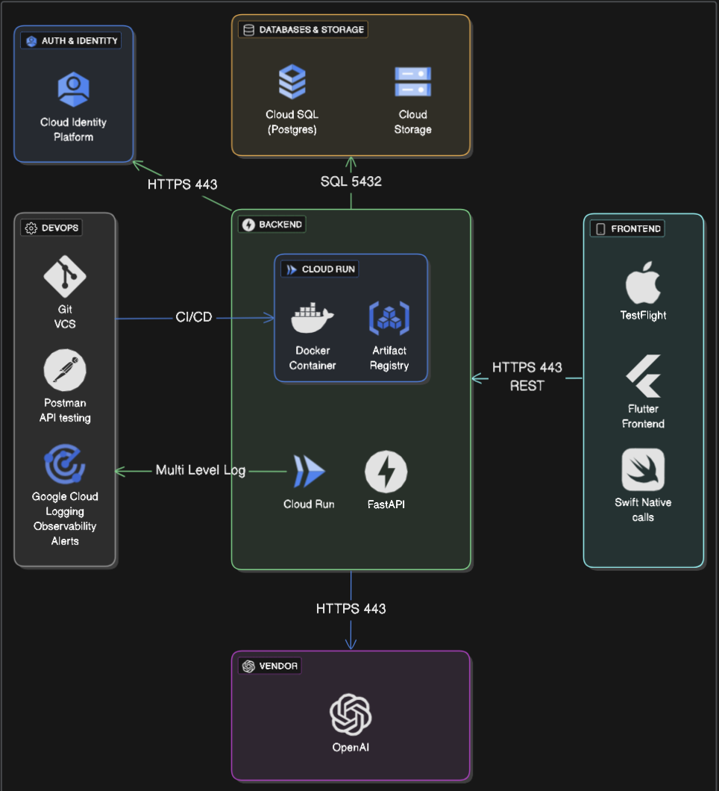

# Architecture Diagram

## Diagram

## Explanation

Our architecture is designed as a lightweight backend interacting with a Flutter IOS app running on Google Cloud. The core backend will be a FastAPI container running on Google Cloud Run calling out to the OpenAI API for AI inference, using a lightweight CloudSQL instance for persistent storage such as property data, and google cloud identity platform for auth. 

### Frontend: Flutter IOS app

Flutter was chosen because we our team members had previous experience with the framework, and because we cannot use SwiftUI due to one of our team members using a Windows computer. For any lower level iOS calls that need to be made, we can use Swift code on some parts of the code. One of our members already have an apple developer account so that we can sign the iOS app and put it up on TestFlight.

### Backend: FastAPI running on Cloud Run

FastAPI is great for rapid development, using python as it's language of choice, while maintaining similar runtime performance as languages like Golang. We are likely using python to run our fine-tuning on the OpenAI API anyways, so using a single language and toolsets will keep things ergonomic for the developers.
We are choosing to use Google Cloud Run since we don't want to manage our own compute instance nor use K8s. We don't have resources for SRE/infra management so this make Cloud Run a pragmatic approach. The nice thing is that we're containerizing anyways so if we ever want to scale up to other compute types we are always flexible. We will have to make sure we set correct concurrency limits so that we don't accidentally overscale and run up our cloud bill.

The cons of this approach is the cloud run is more expensive per compute hour, but since we can always scale to 0, for our application with low traffic, we won't be wasting money keeping the service up on low traffic. 
There's always cold start concerns with serverless in general, but this is negligible currently as we aren't hyper optimizing at this stage in our startup.

### Database: PostgreSQL on Cloud SQL

Tough choice between using an RDB vs firebase NoSQL, but we don't foresee a sudden need for horizontal scalability due to our relatively straightforward business logic and entities, and would rather use a faster SQL based DB that let's us do complex queries. 

PostgresSQL is open source, fast, mature and battle tested in production environments around the industry. There's plenty of documentation and the latest features providing concurrency and redundancy makes it a straightforward choice. 

The cons are that CloudSQL costs an arm and a leg, but this can be mitigated by using the smallest CloudSQL instance and avoiding additional enterprise features.

Cloud SQL also plays really nicely with Cloud Run and can be easily configured to have a private connection set up with the cloud run instance.

### Auth: Google Cloud Identity Platform
Since we're going hosting our infra on GCP, might as well take advantage of GCP's free user management service (up to 50k users). This will save us in 3 aspects:
- We're not rolling our own auth so we don't have to worry about the nitty gritty of maintaining a secure user DB like secure salting and hashing.
- We don't have to code jwt logic ourselves into our backends but rather call the relevant endpoints that gcloud identity provides us with.
- Easy Oauth/3rd party providers; Sign in with Google, Facebook etc.

### Vendor Integration: OpenAI API

OpenAI has the most mature API along with fine-tuning capabilities that allows us to customize an LLM to our business purposes without having to host an entire instance ourselves. The overhead of running an LLM (especially multi-modal) ourselves with fast enough inference would be infeasible given the scope of our MVP. Using OpenAPI's API is a no brainer.

Cons are obviously we become dependant on 3rd party + additional costs.

### DevOps

### GitHub
Including this one because not only are we storing code, but we're likely going to be using some github actions for just to get containers uploaded to Google Artifact Registry + we're using it for agile tracking.

#### Postman
Industry standard API testing, lets us store API calls on cloud rather than manually sharing cURL snippets.

#### Gcloud Logging
Comes with Cloud Run, fast, lets you filter log levels, set alerts, and some of the best log querying out of any cloud provider, advanced log-based metrics capabilities.

## Alignment with Use Cases

This architecture directly supports our Critical User Journeys (CUJs) by ensuring:

1. Clean, familiar UI frameworks along with the Apple iOS ecosystem for easy installation and keeping in line with lightweight, efficient UX.

2. High velocity development, and reactive iteration to cohere to alpha and beta test findings.

3. Secure auth, reliable AI inference, and near-0 downtime by taking advantage of existing cloud and vendor solutions. (Not like that tea app!)