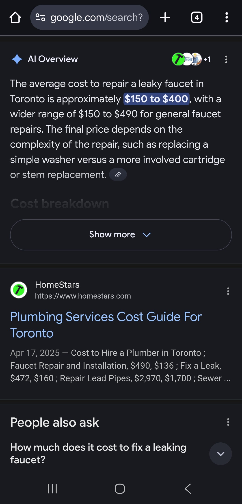

# A7 Competitive CUJ Document
Hello World

### Date: 11/05/2025

## Group Details:
### Group Name - PropertySense   
- David Barsamyan - 1008131601
- Sunny Kim - 10084121931
- Carol Meng - 1008593675

## TL;DR

## User Goal
As a homeowner with a plumbing issue, I want to find a reliable and affordable contractor near me, so that I can book the repair quickly without worrying about scams or unclear pricing.

## Summary of Findings

### User Persona
The Practical Homeowner represents urban and suburban property owners who often face small but urgent repair needs, for example leaky faucets, damaged walls, faulty outlets, etc. They’re moderately tech-savvy, accustomed to using mobile apps like Uber, DoorDash, and SkipTheDishes, and expect similar levels of speed, trust, and transparency when booking real-world services. Their expertise in using service platforms is solid in terms of navigation and search, but limited in satisfaction; they’re frustrated by unclear pricing, generic search results, and unreliable contractors. The Practical Homeowner values simplicity, verified professionals, and upfront clarity about cost and scheduling. They usually begin their search on Google, browse a few options such as TaskRabbit or Kijiji, and make their decision based on ratings and photos rather than brand loyalty. They dislike having to describe repair problems in vague text fields or negotiate prices through calls. What they crave is a single, confident workflow that allows you to upload, confirm, and book without having to worry about scams, cancellations, or inconsistent quality.

### Tools Used
Device Used: Smartphone (Android, Chrome browser).

- Google Search (Mobile) – To research repair costs, parts, or causes before deciding to hire help.
- Phone Camera / Google Image Search – Used to visually inspect the issue or search for similar examples to self-diagnose the problem.
- TaskRabbit Mobile – Main interface for selecting the service category, describing the repair, and viewing contractor options.

### Highlights and Lowlights

| **Category** | **Step(s)** | **Description / What Happened** | **Severity** |
|--------------|------------|----------------------------------|----------------------------|
| **Pre-Platform Research** | Steps 0–1 | Before using TaskRabbit, the user spent time Googling the issue and comparing images. While helpful for basic understanding, this added time and confusion because results varied and costs weren’t specific to their home setup. The lack of integrated visual cost estimation led to uncertainty. | **Moderate** |
| **Search and Entry** | Steps 2–3 | Google search led directly to TaskRabbit’s site. The mobile layout was clean and trustworthy, with visible service categories like “Home Repairs.” | **Great** |
| **Task Setup Process** | Steps 4–6 | The step-by-step setup (address → task size → description) was simple and visually clear. However, having to describe the issue manually introduced uncertainty — no visual aids or image upload option. | **Moderate** |
| **Pricing Transparency** | Steps 7 | Hourly rates were visible for each Tasker, but users couldn’t see the estimated total cost for their repair type. Without AI or guided estimates, the pricing felt arbitrary. | **Severe** |
| **Contractor Browsing** | Steps 7-8 | Contractor cards with photos, ratings, and bios made selection intuitive, but too many similar options increased cognitive load. | **Moderate** |
| **Scheduling** | Steps 9 | Integrated calendar simplified selecting available times, helps avoid lengthy back and forth negotiations with the contractors. | **Great** |
| **Trust & Security Perception** | Steps 1-10 | Verified profiles with ratings and secure Stripe payments built confidence, but lack of upfront cost prediction or escrow protection limited perceived safety. | **Moderate** |

### Reflection and Areas of Improvement
The competitive CUJ revealed that the homeowner user journey actually begins before opening any platform, with self-diagnosis attempts and independent Google searches. This “pre-platform phase” exposes a critical gap in the home repair process: users spend several minutes trying to estimate what’s wrong and how much it should cost, but the information they find is inconsistent, generalized, or contradictory. While this step helps users feel more informed, it often increases anxiety rather than confidence. They start their TaskRabbit search without a clear baseline, making the later hourly-rate listings feel arbitrary and risky. Within TaskRabbit itself, the platform performs well in accessibility and trust-building but falls short in transparency and automation. The absence of AI-assisted image input forces users to manually describe problems, leading to potential mismatches between perceived and actual scope. This limitation not only increases uncertainty but also prolongs the time between problem recognition and service booking. Similarly, TaskRabbit’s hourly payment model lacks the sense of fairness and control that comes with escrow-backed or milestone-based payment systems. Users must trust that the professional’s reported hours are accurate, and there is no built-in mechanism for dispute resolution beyond platform reviews. Overall, TaskRabbit simplifies the logistics of finding help but fails to address the cognitive friction of decision-making, the parts where users are uncertain about cause, price, or fairness.

#### Product Recommendations for TaskRabbit
- Integrate photo or video-based AI diagnostics: Let users upload a picture of their issue and receive an instant estimated cost range before browsing Taskers.
- Introduce guided cost benchmarks: Show realistic price ranges for common repair types instead of only hourly rates.
- Implement partial or escrow-based payment holds: Add automatic payment release after verified completion or photo proof from both sides.
- Offer pre-task summaries: Before confirming, show a breakdown (“estimated total time,” “suggested materials,” “average local rate”).

#### Product Recommendations for PropertySense
- These findings reaffirm the strength of PropertySense AI’s model: AI-powered image analysis gives users clarity before they even browse professionals.
- Escrow-backed transactions directly resolve the homeowner’s fear of overpayment or incomplete work.
- Providing side-by-side verified bids transforms the comparison stage from guesswork into transparent decision-making.
- The inclusion of automated photo verification upon completion adds trust and evidence, that is missing in TaskRabbit with lack of an end-to-end accountability loop.

## Competitor Product Analysis

TaskRabbit’s experience reveals both the strengths and structural gaps in the current home-repair marketplace. Its core strength lies in trust visibility and ease of use: homeowners can instantly browse verified Taskers with ratings, photos, and hourly rates, all inside a clean, mobile-friendly interface. The platform’s brand credibility and geographic reach also inspire confidence. Compared with social media listings or marketplaces like Kijiji, TaskRabbit feels safe, standardized, and quick to navigate. The scheduling calendar and payment integration through Stripe create a seamless transaction once the right Tasker is chosen. For small or routine tasks, this efficiency and availability remain its most delightful aspects.

However, TaskRabbit’s weaknesses become clear when evaluating pricing transparency, diagnostic accuracy, and payment protection. Users must describe problems manually, relying on text fields rather than images or structured data. This leads to uncertainty about how complex a repair might be and whether the hourly rate will reflect real effort or unforeseen complications. The lack of AI-assisted cost estimation means homeowners often begin with unrealistic price expectations. Furthermore, TaskRabbit’s hourly payment model shifts risk toward the client since there is no escrow or milestone-based safeguard ensuring that work quality or completion aligns with payment release. Finally, while its rating system builds social trust, it does not guarantee objective verification of completed tasks.

PropertySense AI directly addresses these limitations. Its AI-powered photo analysis provides instant visual cost estimates, giving users clarity before they ever contact a contractor. Escrow-backed payments protect both sides by releasing funds only after verified completion, solving the fairness and accountability gaps left by TaskRabbit. Side-by-side bids from verified professionals turn the browsing stage into transparent comparison instead of guesswork. Unlike TaskRabbit, PropertySense AI will not compete on generic gig coverage or non-repair errands; it focuses exclusively on verified home-repair and maintenance work, where trust, precision, and cost transparency matter most.

## CUJ Overview Table

| **Phase**                  | **Steps** | **Estimated Time** | **Context Switches** |
| -------------------------- | --------- | ------------------ | -------------------- |
| **Self-Diagnosis & Research**     | 0–1       | ~10 min       | 5         |
| **Seach & Entry**     | 2–3       | ~2 min       | 1         |
| **Task Setup**   | 4–6       | ~5 min       | 1        |
| **Contractor Selection** | 7–8       | ~2 min          | 1        | 
| **Scheduling & Confirmation** | 8-9       | ~2 min          | 1        |
| **Sign-Up & Payment Setup**        | 9-10         | ~4 min       | 1         |

**Total Time**: ~25 minutes

**Total Context Switches**: ~10

## End-to-End User Journey Documentation

| **Step**                  | **Notes** | **Screenshot** | 
| -------------------------- | --------- | ------------------ | 
| **0. Research the Issue**     | Searched Google for “leaky faucet repair cost.” Read quick DIY blogs and average cost estimates ($100–200). Provided rough expectations before finding homerepair professional.       |        | 
| **1. Visual Comparison and Image Search**   | Used phone camera and Google Lens to find similar faucet issues. Tried to confirm if problem was “minor leak” or “pipe damage.” Realized self-diagnosis was uncertain, prompting use of a repair platform.       |        |
| **2. Seach & Entry**     | Googled “home repair” and opened the TaskRabbit official website. Homepage showed clear service categories and CTA buttons.       |        | 
| **3. Select Home Repairs Category**   | Chose “Home Repairs,” which redirected to a form for address input.       |        |
| **4. Input Address** | Entered street name and number, as well as the postal code to find nearby Taskers. Smooth and quick location detection.       |           |
| **5. Choose Task Size** | Selected "Small (1 hour)" from three available options. The system gave approximate time ranges but no fixed pricing.       |           | 
| **6. Describe the Issue**        | Typed “plumbing” in the free-text field. No photo upload option, meaning users must describe issues manually.        |        | 
| **7. View Available Taskers**        | TaskRabbit displayed local Taskers with hourly rates, ratings, and short bios. Results sorted by “Recommended.”        |        | 
| **8. Select Tasker and Schedule**        | Tapped one Tasker profile, reviewed details, and chose a time slot via built-in calendar. Straightforward but required multiple taps.        |        | 
| **9. Redirect to Sign-Up**        | Upon confirming time, redirected to create an account (email or Apple login) and prompted for credit card setup.        |        | 
| **10. Post-Booking, Payment**        | After setting up account with credit card information, the Tasker receives request, confirms job, and completes task. Payment and tip handled automatically via Stripe.        |  | 
