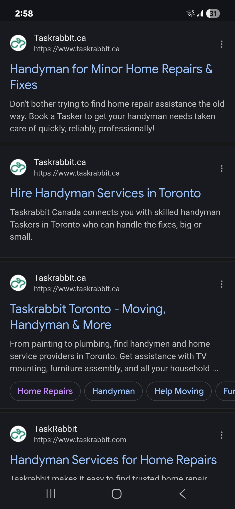
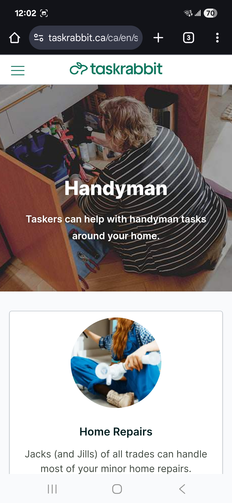
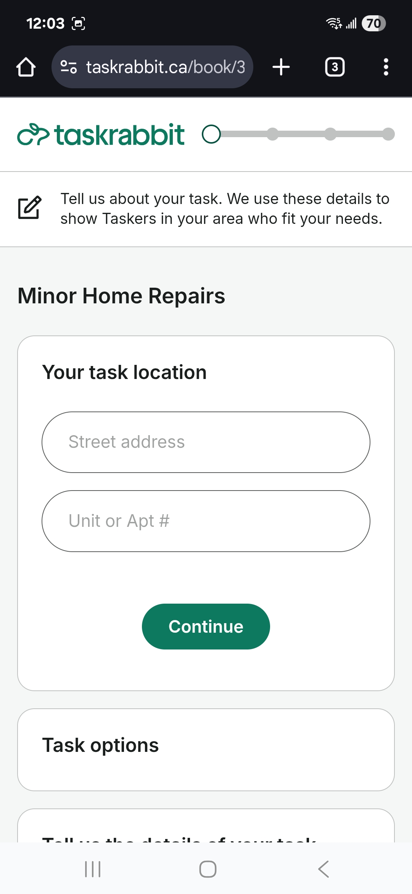
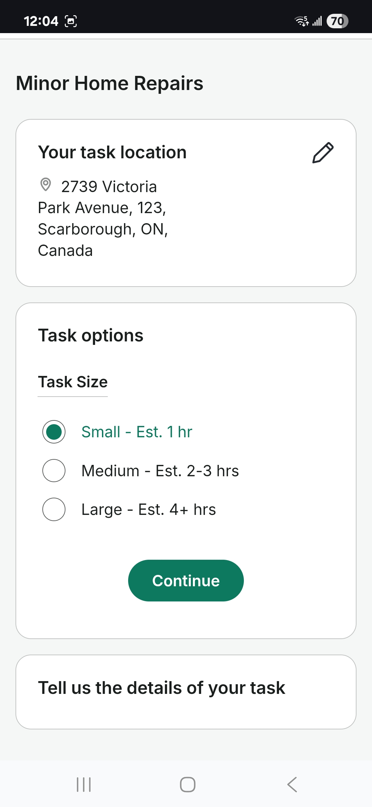
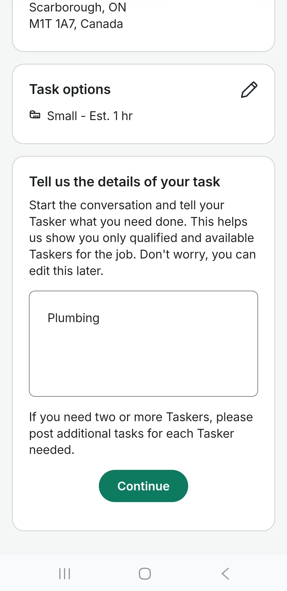
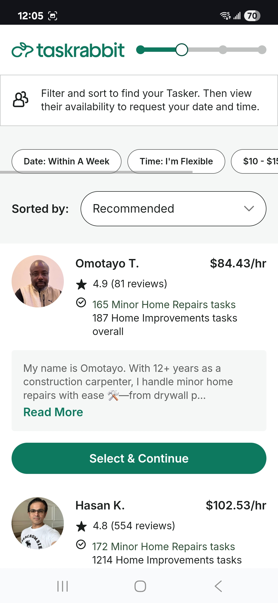
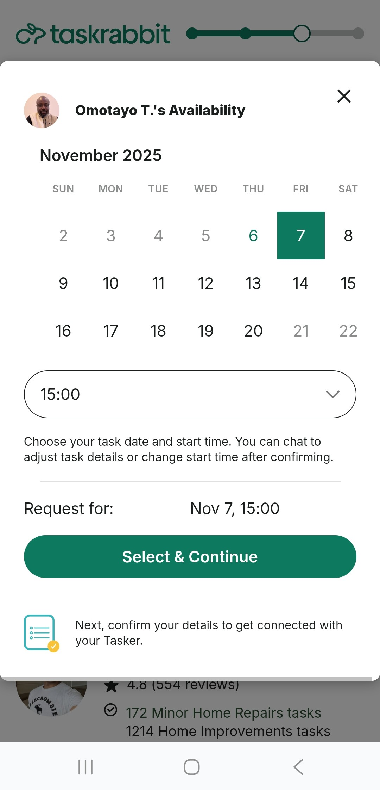
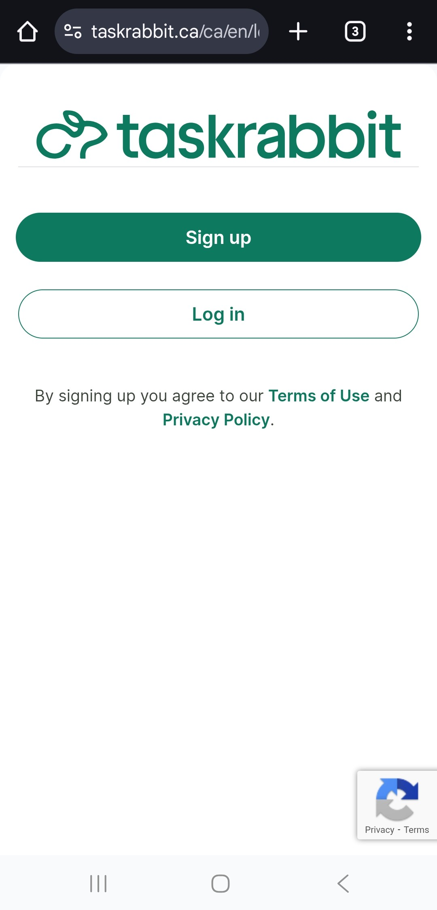
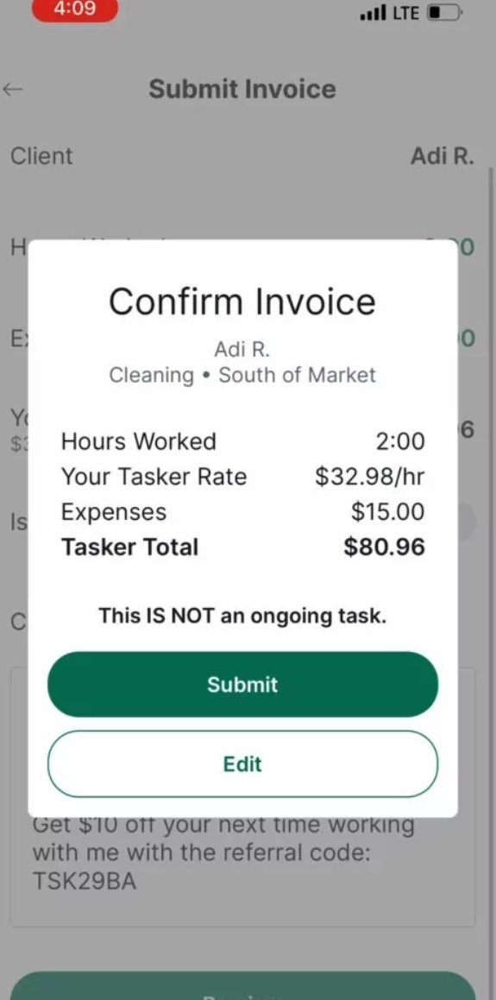

# A7 Competitive CUJ Document
Hello World

### Date: 11/05/2025

## Group Details:
### Group Name - PropertySense   
- David Barsamyan - 1008131601
- Sunny Kim - 10084121931
- Carol Meng - 1008593675

## TL;DR

## User Goal
As a homeowner with a plumbing issue, I want to find a reliable and affordable contractor near me, so that I can book the repair quickly without worrying about scams or unclear pricing.

## Summary of Findings

### User Persona
The Practical Homeowner represents urban and suburban property owners who often face small but urgent repair needs, for example leaky faucets, damaged walls, faulty outlets, etc. They’re moderately tech-savvy, accustomed to using mobile apps like Uber, DoorDash, and SkipTheDishes, and expect similar levels of speed, trust, and transparency when booking real-world services. Their expertise in using service platforms is solid in terms of navigation and search, but limited in satisfaction; they’re frustrated by unclear pricing, generic search results, and unreliable contractors. The Practical Homeowner values simplicity, verified professionals, and upfront clarity about cost and scheduling. They usually begin their search on Google, browse a few options such as TaskRabbit or Kijiji, and make their decision based on ratings and photos rather than brand loyalty. They dislike having to describe repair problems in vague text fields or negotiate prices through calls. What they crave is a single, confident workflow that allows you to upload, confirm, and book without having to worry about scams, cancellations, or inconsistent quality.

### Tools Used
Device Used: Smartphone (Android, Chrome browser).

- Google Search (Mobile) – To locate and access the TaskRabbit homepage.
- TaskRabbit Mobile – Main interface for selecting the service category, describing the repair, and viewing contractor options.

### Highlights and Lowlights

| **Category** | **Step(s)** | **Description / What Happened** | **Severity** |
|--------------|------------|----------------------------------|----------------------------|
| **Search and Entry** | Steps 1–2 | Google search led directly to TaskRabbit’s site. The mobile layout was clean and trustworthy, with visible service categories like “Home Repairs.” | **Great** |
| **Task Setup Process** | Steps 3–5 | The step-by-step setup (address → task size → description) was simple and visually clear. However, having to describe the issue manually introduced uncertainty — no visual aids or image upload option. | **Moderate** |
| **Pricing Transparency** | Steps 6 | Hourly rates were visible for each Tasker, but users couldn’t see the estimated total cost for their repair type. Without AI or guided estimates, the pricing felt arbitrary. | **Severe** |
| **Contractor Browsing** | Steps 6-7 | Contractor cards with photos, ratings, and bios made selection intuitive, but too many similar options increased cognitive load. | **Moderate** |
| **Scheduling** | Steps 8 | Integrated calendar simplified selecting available times, helps avoid lengthy back and forth negotiations with the contractors. | **Great** |
| **Trust & Security Perception** | Steps 1-9 | Verified profiles with ratings and secure Stripe payments built confidence, but lack of upfront cost prediction or escrow protection limited perceived safety. | **Moderate** |

### Reflection and Areas of Improvement

## Competitor Product Analysis

### Overview

### Strengths

### Weaknesses

### Comparison to Your Product

## CUJ Overview Table

| **Phase**                  | **Steps** | **Estimated Time** | **Context Switches** |
| -------------------------- | --------- | ------------------ | -------------------- |
| **Seach & Entry**     | 1–2       | ~2 min       | 1         |
| **Task Setup**   | 3–5       | ~5 min       | 1        |
| **Contractor Selection** | 6–7       | ~2 min          | 1        | 
| **Scheduling & Confirmation** | 7-8       | ~2 min          | 1        |
| **Sign-Up & Payment Setup**        | 8-9         | ~4 min       | 1         |

## End-to-End User Journey Documentation

| **Step**                  | **Notes** | **Screenshot** | 
| -------------------------- | --------- | ------------------ | 
| **1. Seach & Entry**     | Googled “home repair” and opened the TaskRabbit official website. Homepage showed clear service categories and CTA buttons.       |        | 
| **2. Select Home Repairs Category**   | Chose “Home Repairs,” which redirected to a form for address input.       |        |
| **3. Input Address** | Entered street name and number, as well as the postal code to find nearby Taskers. Smooth and quick location detection.       |           |
| **4. Choose Task Size** | Selected "Small (1 hour)" from three available options. The system gave approximate time ranges but no fixed pricing.       |           | 
| **5. Describe the Issue**        | Typed “plumbing” in the free-text field. No photo upload option, meaning users must describe issues manually.        |        | 
| **6. View Available Taskers**        | TaskRabbit displayed local Taskers with hourly rates, ratings, and short bios. Results sorted by “Recommended.”        |        | 
| **7. Select Tasker and Schedule**        | Tapped one Tasker profile, reviewed details, and chose a time slot via built-in calendar. Straightforward but required multiple taps.        |        | 
| **8. Redirect to Sign-Up**        | Upon confirming time, redirected to create an account (email or Apple login) and prompted for credit card setup.        |        | 
| **9. Post-Booking, Payment**        | After setting up account with credit card information, the Tasker receives request, confirms job, and completes task. Payment and tip handled automatically via Stripe.        |  | 
