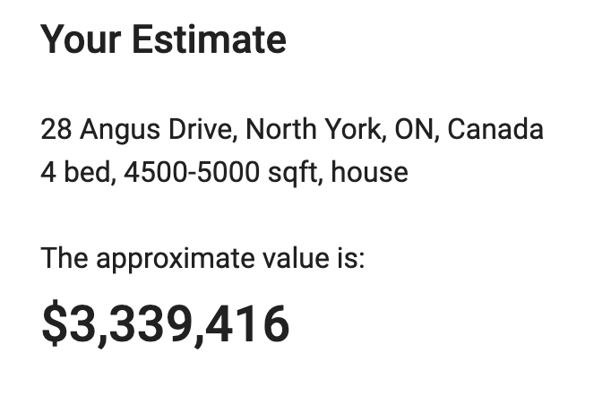
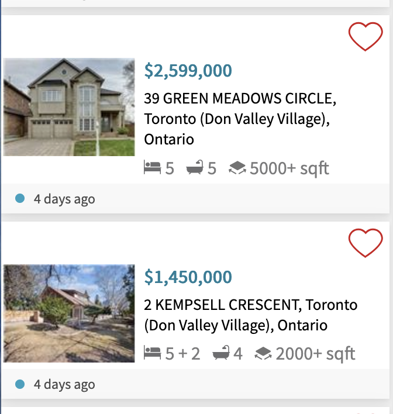
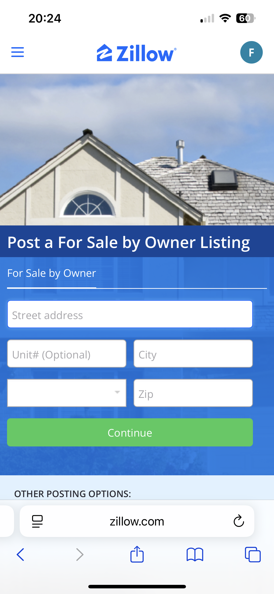
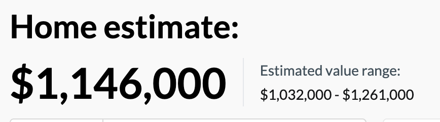

# A3 CUJ Runthrough + Demo

**Team PropertyVision**

**Group Members:**
- Sunny Kim – 100084121931
- Carol Meng - 1008593675
- David Barsamyan - 1008131601

**Submission Date:** 2025/09/24

## ⚡ TL;DR (Max 65 words)

We tested multiple property valuation tools as Canadian homeowners seeking accurate home estimates. Started with Masterkey/Zillow but found hit geographical restrictions. Then Zolo which gave an estimate $1million off from similar properties in the area. Finally Wahi, which provided $1.1million estimate. Process took 10 minutes but prices seem low for 3 bedroom unit. No tools used photo data for enhanced accuracy.

## 🎯 Goal

As a **Canadian homeowner considering selling my 3-bedroom house**, I want to **get an accurate current valuation of my property using available online tools**, so that I can **understand my home's market value and determine realistic pricing expectations before making selling decisions**.

## 🧰 Tools Used

- Masterkey/Zillow website
- Google Search for Canadian property valuation options
- Zolo property valuation platform
- Wahi home valuation tool
- Safari browser on iPhone
- Screenshots app for documentation

## 🧑‍💻 Persona Description

**Role / Background:**  
Canadian homeowner with a 3-bedroom house in suburban Toronto, considering market timing for potential sale

**Experience Level:**  
Familiar with basic real estate websites like Realtor.ca, comfortable with using online tools, no experience using valuation platforms

**Familiarity with Platform:**  
Complete newcomer to automated valuation tools, discovered options through web search for "property valuation tools"

## 📘 Summary of Findings (Approx. 600 words)

My 5-minute journey through property valuation tools revealed the frustrating reality of getting accurate home estimates as a Canadian homeowner. What should have been a simple process turned into a series of geographic restrictions and platform limitations.

**Starting with MasterKey and Platform Limitations**  
I began by searching for "property valuation tools" and found Masterkey, which immediately caught my attention with its promise of enhanced property analysis in seconds. However, their homepage required pasting a Zillow link to get started – an unusual approach that made me wonder about their independence from Zillow's ecosystem, and ability to analyze property listed in other places. It also requires payment and the property to already exist on Zillow, so I decided to come back to this option later.

**Pivoting to more independent valuation platforms**
I searched specifically for "home valuation tools Canada" and discovered Zolo, which appeared to be a free Canadian-focused platform with no external dependencies. Instead of taking a Zillow link as input, it takes an address, property type, number of beds, and area. The estimate it gave me is over $3million. For comparison, I looked up similar surrounding properties in my area on realtor.ca since that's what I'm familiar with. Their listed prices are nowhere near this expensive, some off by $1million. So this, combined with Zolo's lack of transparency about why exactly my property is over 3 million, makes me skeptical of the accuracy of Zolo.

**The Masterkey/Zillow Dead End**  
I decided to come back to try Masterkey. Since Masterkey requires my property to exist as a listing on Zillow, I navigated to Zillow's website, where I was prompted to choose between their mobile app and web interface. I selected Safari and proceeded with account creation. The first major frustration emerged when I tried entering my Toronto house address. At first glance, Zillow seems to have Canadian properties in their system, but it's incredibly inconsistent, and it's not clear at all what addresses can be inputted.

Thinking there might be a different procedure, I Google searched for "how to post Zillow listing", and it took me to a different looking interface, where I discovered that only U.S. addresses were supported. This geographic limitation wasted valuable time and created unnecessary frustration.

**Wahi is pushy but it works**  
Then, I found Wahi, which looks promising and Canadian addresses seemed to work. But when I clicked the "Sell" option on their front page, I had to scroll through several screens of marketing content pushing me to sign up for Wahi's "Cashback Program".
I eventually navigated to my Wahi profile to find the valuation function. It processed my address and guided me through their valuation workflow. The platform required inputting interior and exterior information, when my property was purchased, and annual property taxes and maintenance fees – information that felt relevant for house valuations but required me to dig up recent documents.

**Results and Reality Check**  
Wahi provided an estimate of $1.1million with a range from $1.0million to $1.3million. While the process was smooth, the result felt low for my 3-bedroom unit. Based on my knowledge of local market conditions, this pricing seems to be on the low end, and seemed more appropriate for 1-2 bedroom units in the area rather than a 3-bedroom property.

**The Missing Piece: Visual Data**  
Throughout this entire process, no platform offered photo-based valuation enhancement. Given that my unit has been renovated and has unique features that distinguish it from comparable units, the lack of visual analysis felt like a significant limitation in accuracy.

**Time Efficiency vs. Accuracy Trade-off**  
While the entire process took only 10 minutes and 11 seconds, this speed came at the cost of accuracy and detail. The rapid results made me question whether these tools can truly capture the nuances that affect property value, especially in diverse housing markets like Toronto.

## 💡 Recommendations

**For Property Valuation Platforms (Product Improvements):**
- Clearly communicate geographic limitations upfront (US vs Canada availability)
- Improve Canadian address databases and coverage, especially for newer developments
- Add photo-based valuation enhancement to differentiate from basic estimates
- Provide clearer explanations of valuation methodology
- Include property type-specific context
- Offer confidence intervals and accuracy estimates rather than single-point estimates
- Streamline onboarding and happy paths for buyers vs sellers

**For Future Canadian Homeowners:**
- Start with Canadian-specific platforms (Wahi, Zolo) rather than US-based tools
- Have property tax and maintenance fee information readily available for condos
- Expect limitations with newer addresses or less-covered postal codes
- Use multiple platforms and compare results for better accuracy assessment
- Consider the speed vs accuracy trade-off – 5-minute estimates may lack nuance
- Research recent comparable sales independently to validate automated estimates
- Remember that condo valuations require different factors than house valuations

## Highlights & Lowlights Table

| Task | Severity | Notes |
|------|----------|-------|
| Found MasterKey platform | Great | Clear landing page, easy to discover through search |
| MasterKey requires Zillow link | Moderate | Unusual dependency, but instructions were clear |
| Zillow signup process | Great | Smooth account creation, good mobile optimization |
| Canadian address lookup failure | Severe | Wasted time, geographic limitation not communicated upfront |
| Zillow listing attempt | Severe | Confusing navigation, partner agent marketing instead of listing tools |
| Google search for alternatives | Great | Quick discovery of Canadian-specific platforms |
| Zolo address lookup failure | Severe | Second platform unable to find property, concerning pattern |
| Wahi signup and address success | Great | Finally found working Canadian platform |
| Property tax/fee data entry | Moderate | Required digging up documents but felt relevant for accuracy |
| Wahi valuation results | Moderate | Fast results but seemed low for 3-bedroom unit |
| No photo-based enhancement | Severe | Missing key differentiator for accurate modern valuations |

## CUJ Overview Table

| Task | Time | Switches |
|------|------|----------|
| Google search for valuation tools | 1 min 30 sec | 0 |
| Navigate to MasterKey and read requirements | 45 sec | 0 |
| Go to Zillow and choose web interface | 40 sec | 1 |
| Zillow account signup process | 1 min 15 sec | 0 |
| Attempt Canadian address lookup | 1 min 45 sec | 0 |
| Search for listing functionality | 1 min 20 sec | 0 |
| Google "how to post Zillow listing" | 50 sec | 1 |
| Discover US-only limitation | 35 sec | 0 |
| Search "home valuation tools Canada" | 55 sec | 1 |
| Try Zolo platform and address failure | 1 min 25 sec | 1 |
| Navigate to Wahi platform | 40 sec | 1 |
| Complete Wahi signup and property details | 1 min 40 sec | 0 |
| Review $659K valuation results | 30 sec | 0 |

**Total Time:** 12 minutes  
**Total Context Switches:** 5

## Full CUJ Table (Step-by-Step Documentation)

| Step | Notes (What + Why) | Screenshot |
|------|-------------------|------------|
| 1 | Googled "property valuation tools" to find automated home estimate platforms. Found MasterKey among top results. | |
| 2 | Entry to MasterKey landing page. Homepage clearly stated requirement to "paste a Zillow link" to get started. |  |
| 3 (switch) | Navigated to Zillow.com as instructed by MasterKey. Website prompted choice between mobile app and web interface. |  |
| 5 | Selected "Continue in Safari" to use web interface. Clicked "Sign In" and completed account creation with Apple. Process was straightforward and quick. |  |
| 6 | Attempted to enter Toronto condo address in search bar to get home estimate. System couldn't locate exact Unit number. |  |
| 7 | Decided to try uploading property as listing instead. Looked for "Post a Listing" or similar option in navigation. |  |
| 8 | Found mostly marketing content about "Zillow Partner Agent" services instead of clear listing tools. Confusing user flow. |  |
| 9 (switch) | Used Google to search "how to post Zillow listing" to find proper listing interface since navigation was unclear. |  |
| 10 | Google results led to Zillow's listing section. Discovered that only US addresses are supported - geographic limitation not communicated earlier. |  |
| 11 (switch) | Searched "home valuation tools Canada" to find platforms that actually support Canadian properties. |  |
| 12 (switch) | Tried Zolo platform first. Interface looked promising for Canadian properties but couldn't find my specific address either. |  |
| 13 (switch) | Moved to Wahi platform. Successfully found my Canadian address and began valuation process. (Still no unit number though) |  |
| 14 | Wahi required additional property details including annual taxes and maintenance fees. Had to look up exact figures from recent documents. | |
| 15 | Submitted all required information and received instant results: $659K estimate with range $593K-$725K. Fast but seemed low for 3-bedroom. |  |

---

*Note: This CUJ analysis reflects the real experience of homeowners using AI property valuation tools and highlights common pain points that create opportunities for improved solutions.*
