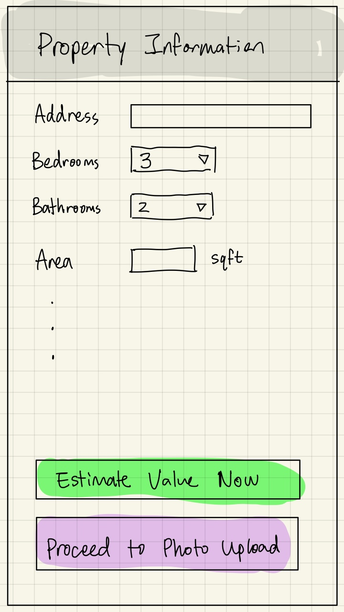
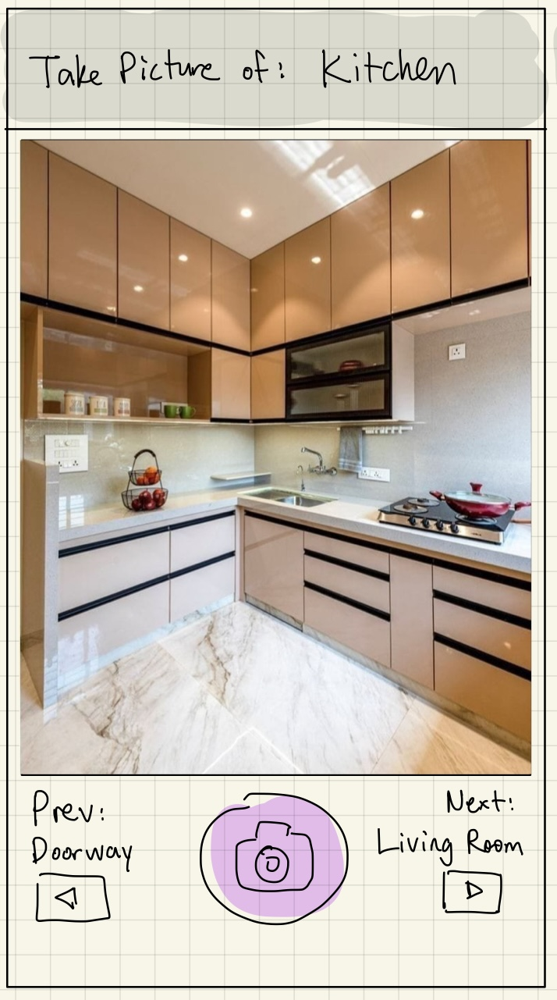
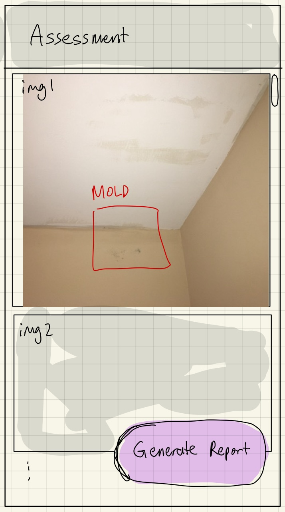
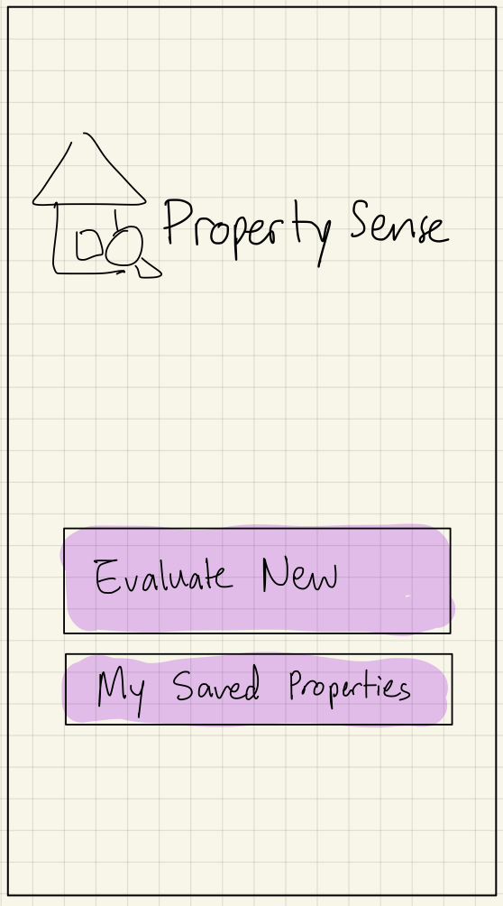
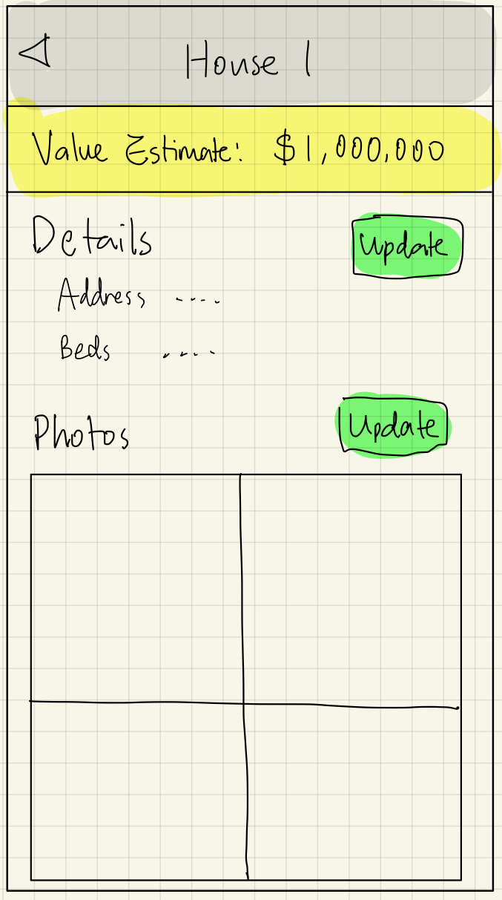

# Use Cases

## Jobs To Be Done (JTBD)

1. **As a Canadian homeowner preparing to sell**, I want to obtain an accurate property valuation that incorporates visual inspections of my home's condition, so that I can set realistic pricing expectations and identify potential flaws that could affect market value.  
2. **As a Canadian looking to buy a new house**, I want to use AI-assisted photo analysis to generate preliminary risk reports, and help me evaluate the conditions of a new house, so I can attend more house-showings efficiently.  
3. **As a real estate broker**, I want to quickly analyze client-submitted photos for property risks and flaws, so that I can provide informed advice on repairs and valuations to facilitate faster sales.

---

## Critical User Journeys (CUJs)

### CUJ 1: Property Valuation with Basic Data Input  
- **Scenario**: The user enters property details like address and specs to get an initial valuation estimate.  
- **Journey**:  
  1. User logs into the app on iOS.  
  2. User inputs address, beds/baths/area, age, and other data fields.  
  3. System pulls regional data from APIs and computes a baseline valuation range.  
  4. User reviews the estimate with explanations of factors considered.
  5. Option to proceed to photo upload for enhanced accuracy.
- **UI/UX demonstration**:

---

### CUJ 2: Photo Upload and Flaw Detection  
- **Scenario**: The user uploads photos of key property areas for AI-based inspection.  
- **Journey**:  
  1. From the valuation dashboard, user selects "Add Photos" and follows prompts for angles (e.g., roof, interior).  
  2. App processes images using AI models to detect flaws like cracks or wear.  
  3. System generates a condition grade and risk report, highlighting issues.  
  4. User views annotated photos with flaw markers and severity scores.  
  5. Updated valuation incorporates flaw insights, optionally with repair cost estimates.  
- **UI/UX demonstration**:

---

### CUJ 3: Iterative Valuation Update with New Photos
- **Scenario**: The user wants to refine an existing valuation by adding or replacing photos after initial input.
- **Journey**:
   1. User opens a saved property session from the app dashboard.
   2. Selects "Update Photos" and follows prompts to capture/re-upload specific angles.
   3. System re-processes the new images with AI models to detect changes in flaws or conditions.
   4. Updated condition grade and risk report generates, incorporating the revisions.
   5. Revised valuation range displays with highlights of what changed from the previous estimate.
- **UI/UX demonstration**:

---

### CUJ 4: Comprehensive Report Generation and Sharing  
- **Scenario**: The user compiles valuation and inspection data into a report.  
- **Journey**:  
  1. After data input and photo analysis, user selects "Generate Report"
  2. System aggregates the generated valuation range, flaw detections, regional comparisons, etc. into a single report.
  3. Report includes visualizations like charts and annotated images. 
  4. User exports the generated report as PDF or private link.
- **UI/UX demonstration**:

---

## Functional Requirements

1. **Property Valuation & Data Integration**
   - Users can input basic property information (address, square footage, beds/baths, age, etc.).
   - The system retrieves regional market data via third-party APIs (e.g., MLS, census, municipal data).
   - The system generates an initial valuation range based on public data and comparable listings.
   - Explanations of factors influencing the valuation (e.g., square footage, location, age) are provided.
     
2. **Photo Upload & AI-Powered Flaw Detection**
   - Users can upload or capture photos on the mobile app.
   - The system provides prompts for required angles/areas (e.g., roof, kitchen, basement, exterior).
   - AI models analyze uploaded photos to detect flaws (e.g., cracks, roof wear, water damage).
   - Detected flaws are annotated directly on images with markers and severity scores.
   - Updated valuation incorporates flaw detection results, with optional repair cost estimates.

3. **Report Generation**
   - Users can generate a comprehensive property report combining valuation, flaw detection, and regional comparisons.
   - Reports include visualizations such as annotated images, charts, and condition summaries.
   - Users can export reports as PDFs for offline use.
   - Users can generate a secure, private link to share reports externally.

4. **Iterative Valuation Updates**
   - Users can open previously saved property sessions from a dashboard.
   - Users can replace or add new photos for specific property areas.
   - The system re-processes the updated photo set to detect changes in flaws or conditions.
   - A revised condition grade and updated valuation range are displayed.
   - The system highlights differences between the new and previous valuations (e.g., new flaws, improvements).
     
5. **Deployment and User Authentication**
   - iOS mobile app available through the App Store.
   - Users can register for an account and log in with email and password.
   - Authentication system ensures secure access to saved property sessions.

---

## Non-Functional Requirements

1. **Property Valuation & Data Integration**
   - Valuation calculations complete in ≤3 seconds for standard inputs.
   - Forms and valuation results must render correctly on iOS mobile screens.
   - System must handle API failures gracefully, displaying fallback messages without crashing.
     
2. **Photo Upload & AI-Powered Flaw Detection**
   - Photo upload must complete in ≤5 seconds per image on standard Wi-Fi.
   - AI analysis results returned in ≤10 seconds per batch of 5–10 images.
   - Annotated images must display consistently across devices and screen sizes.

3. **Report Generation**
   - Report generation (PDF or private link) must complete in ≤5 seconds.
   - Exported PDFs should be <10MB, optimized for sharing and mobile viewing.
   - Visualizations (charts, annotated images) must maintain consistent design system styling.
     
4. **Iterative Valuation Updates**
   - Dashboard and saved sessions must load in ≤2 seconds.
   - Updates with new photos must process and return revised valuation in ≤8 seconds.
   - Differences between old and new valuations must be highlighted clearly (ex. colour-coded).
   - System must handle multiple concurrent session updates without conflicts or errors.
     
5. **Deployment and User Authentication**
   - Authentication requests must complete in ≤2 seconds.
   - Auto-logout after 30 minutes of inactivity.
   - iOS mobile app must be fully compatible with the latest iOS version and responsive to various screen sizes.
   - System must support secure session persistence across app restarts and network changes.
  
---
