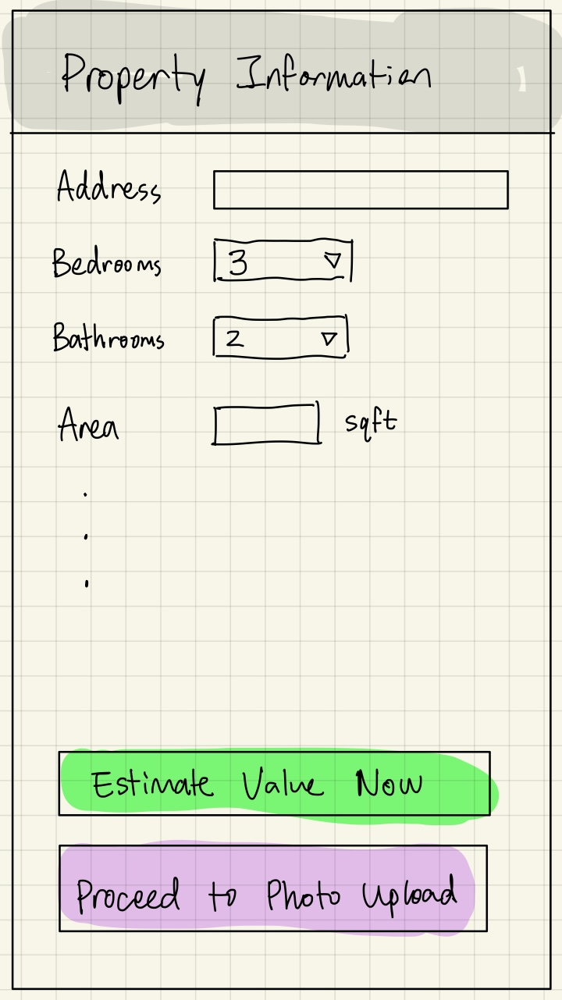
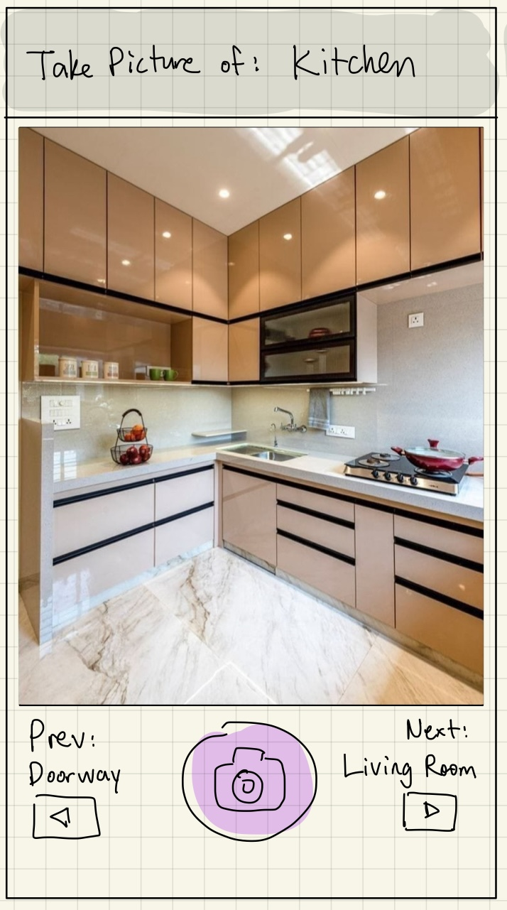
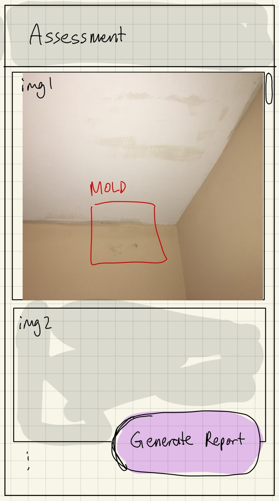
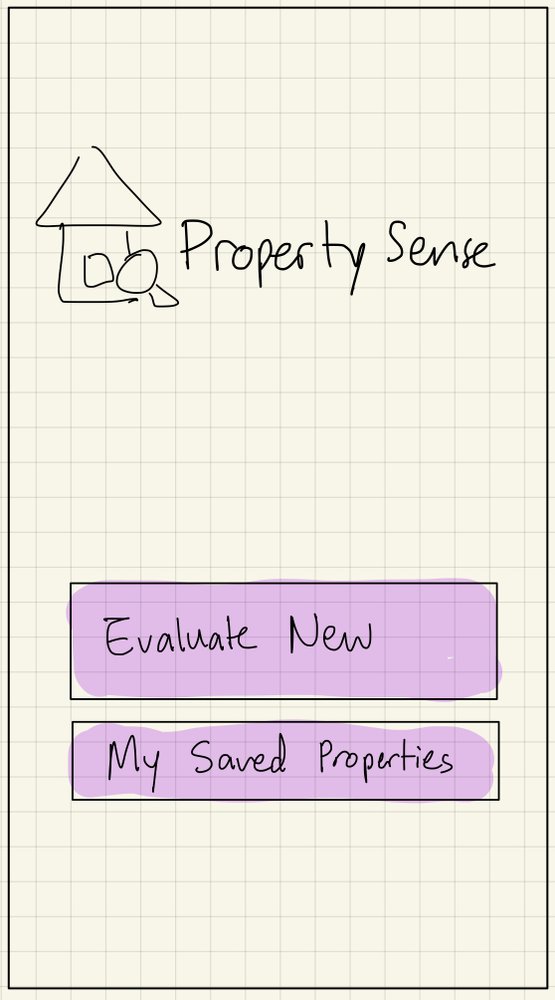
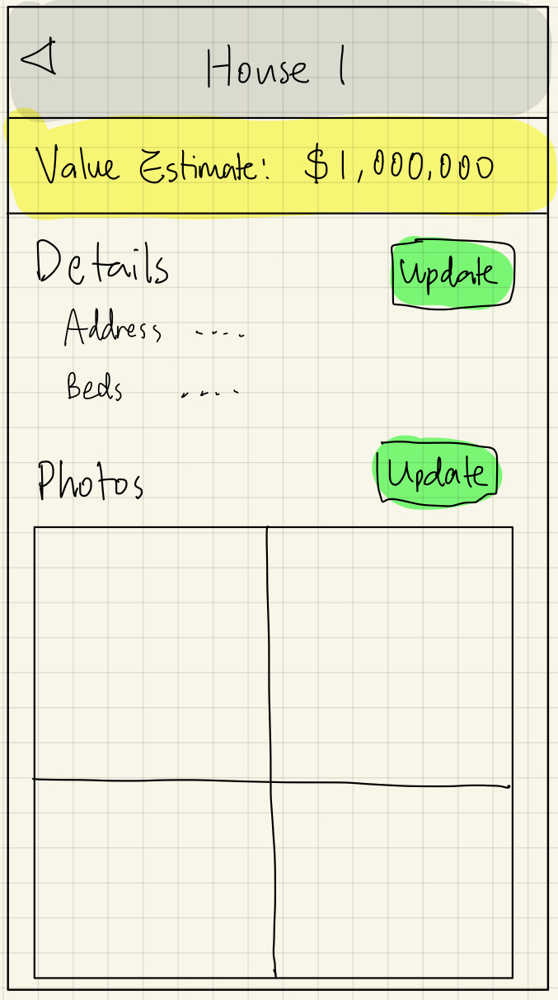

# Use Cases

## Jobs To Be Done (JTBD)

1. **As a homeowner noticing a problem in my house**, I want to take photos of the issue and get an AI-generated diagnosis with a repair cost estimate, so I can understand the problem before contacting a professional.  
2. **As a homeowner needing quick repair service**, I want to receive offers from verified contractors nearby who can fix the issue for the estimated price, so I can book a repair easily and confidently.  
3. **As a licensed contractor or repair professional**, I want to view available nearby repair requests with AI-generated summaries and cost ranges, so I can choose jobs that fit my skills and schedule.

---

## Critical User Journeys (CUJs)

### CUJ 1: AI-Powered Issue Detection and Cost Estimation  
- **Scenario**: The homeowner captures and uploads photos of a home issue to receive an instant AI analysis.
- **Journey**:  
  1. User logs into the app on iOS.  
  2. User selects “New Repair Estimate” and uploads or captures photos of the issue (e.g., leaky pipe, cracked wall).  
  3. AI model analyzes the image to identify issue type and severity.  
  4. The system provides an estimated repair cost range, description of the detected issue, and possible causes.
  5. User can save or proceed to “Find a Contractor.”
- **UI/UX demonstration**:
<!---->

---

### CUJ 2: Contractor Matching and Job Posting  
- **Scenario**: The homeowner wants to connect with verified contractors to fix the identified issue.  
- **Journey**:  
  1. From the AI results page, user selects “Find a Contractor.”  
  2. System automatically creates a repair job listing with photos, issue summary, and estimated budget.  
  3. Verified contractors nearby receive the job request on their app, along with the AI’s estimate and image set.  
  4. Contractors review the photos, verify the issue, and submit their own offers, either confirming or adjusting the suggested price.
  5. Homeowner receives multiple offers with contractor profiles, ratings, and proposed prices.
  6. Homeowner compares offers and confirms a booking directly through the app.  
- **UI/UX demonstration**:
<!---->
<!---->

---

### CUJ 3: Contractor Workflow and Job Completion
- **Scenario**: A verified contractor accepts a repair job, completes the work, and both parties confirm the completion through the app.
- **Journey**:
   1. From the map view, the contractor browses nearby available repair listings created by homeowners.
   2. Contractor opens a listing, reviews the AI-generated issue summary and estimated cost, and decides to accept the job or submit a customized offer if their estimate differs.
   3. Once the homeowner confirms the booking, the contractor completes the assigned repair job.
   4. The contractor opens the job and marks it as “Completed by Me” and the system sends a notification to the homeowner to review the finished job.
   5. The homeowner reviews the work and sets the listing as “Completed,” triggering automatic payment processing.
   6. Both parties receive a receipt, and the option to rate each other.
- **UI/UX demonstration**:
<!---->
<!---->

---
<!--
### CUJ 4: Comprehensive Report Generation and Sharing  
- **Scenario**: The user compiles valuation and inspection data into a report.  
- **Journey**:  
  1. After data input and photo analysis, user selects "Generate Report"
  2. System aggregates the generated valuation range, flaw detections, regional comparisons, etc. into a single report.
  3. Report includes visualizations like charts and annotated images. 
  4. User exports the generated report as PDF or private link.
- **UI/UX demonstration**:

-->
---

## Functional Requirements

1. **AI-Powered Issue Detection & Cost Estimation**
   - Users can upload or capture photos of home issues (e.g., leaks, cracks, wiring).
   - The system analyzes the images using AI to identify issue type, severity, and likely cause.
   - The system generates a repair cost estimate range based on the detected issue type and local market data.
   - Users can view a visual breakdown of detected areas and confidence levels.
   - Users can save the analysis or proceed to “Find a Contractor.”
     
2. **Contractor Matching & Job Posting**
   - The system automatically creates a repair job listing based on AI results (photos, issue summary, estimated cost).
   - Verified contractors nearby receive job notifications with attached AI analysis and details.
   - Contractors can review the image set and submit their own offers, confirming or adjusting the AI estimate.
   - Users (homeowners) can receive, compare, and review multiple contractor offers.
   - Users (homeowners) can confirm a booking directly through the app.
    
3. **Contractor Workflow & Job Completion**
   - Contractors can browse available repair jobs via map or list view.
   - Contractors can accept a job or submit a customized offer if their estimate differs.
   - Contractors can mark a job as “Completed by Me” after finishing the repair.
   - The system notifies the homeowner that the job is marked complete.
   - Homeowners can mark the job as “Completed,” triggering secure payment transfer.
   - The system generates a receipt for both parties and allows them to rate each other.

4. **In-App Payments & Ratings System**
   - Users (homeowners) can make payments securely through the app.
   - The system holds payments in escrow until the homeowner confirms job completion.
   - Users can submit ratings and reviews for each completed job.
   - The system updates user profiles with ratings and adjusts job visibility accordingly.
    
5. **Deployment & Authentication**
   - Users can register for an account and log in with email and password.
   - The system enforces role-based permissions to distinguish between homeowners and contractors.
   - The system ensures secure access to job listings, payments, and personal account data.
   - Users can access the app on iOS devices via the App Store.
   
---

## Non-Functional Requirements

1. **AI-Powered Issue Detection & Cost Estimation**
   - Image upload must complete in ≤5 seconds per image on standard Wi-Fi.
   - AI analysis results returned in ≤10 seconds for up to 10 photos.
   - Visual outputs (annotations, labels, confidence bars) must render consistently across iOS devices.
     
2. **Contractor Matching & Job Posting**
   - Job posting creation must complete in ≤3 seconds after AI analysis.
   - Contractor notifications should appear within ≤2 seconds of job posting.
   - Offer submissions and updates must sync in real time.
   - UI must display all offers clearly and allow sorting/filtering (by price, rating, distance).
    
3. **Contractor Workflow & Job Completion**
   - Map view loads available jobs within ≤2 seconds and updates dynamically based on user location.
   - Status changes (e.g., “Accepted,” “Completed”) must propagate to all parties instantly.
   - Payment trigger on homeowner confirmation must complete securely within ≤5 seconds.
   - The system must maintain a full audit trail for every transaction and job update.
     
4. **In-App Payments & Ratings System**
   - Payment processing latency ≤3 seconds per transaction.
   - Escrow system must ensure funds remain secure until homeowner confirmation.
   - Ratings must update instantly after submission and persist across sessions.
   - User feedback data must sync to backend within ≤2 seconds for analytics and profile updates.
     
5. **Deployment and User Authentication**
   - Authentication requests must complete in ≤2 seconds.
   - Auto-logout after 30 minutes of inactivity.
   - iOS mobile app must be fully compatible with the latest iOS version and responsive to various screen sizes.
   - System must support secure session persistence across app restarts and network changes.
  
---
