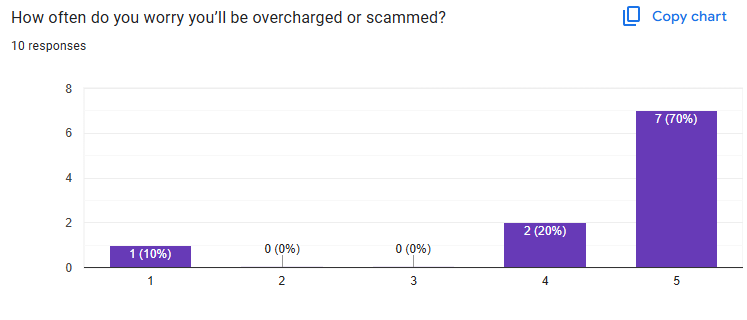
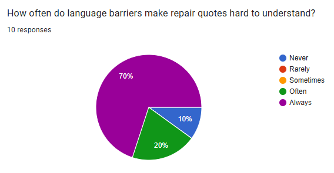
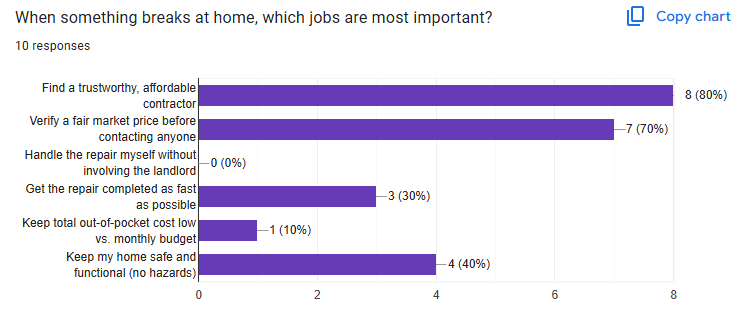
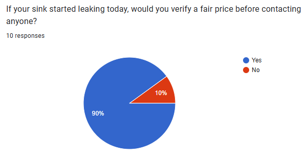
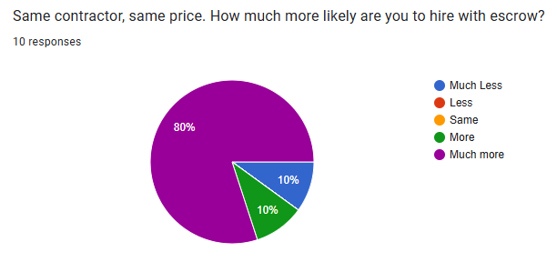
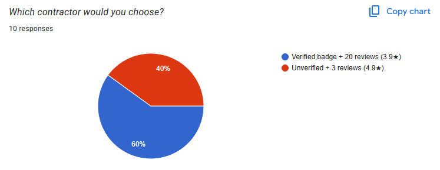
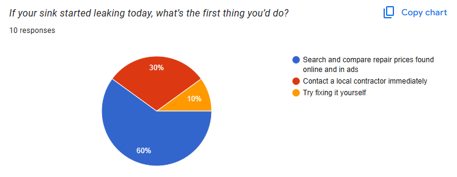

# User Research Report: Home Repair Platform Validation

## Research Overview

- **Research Round:** Round 1 - Problem Validation & Feature Prioritization
- **Date:** October 7, 2025
- **Methodology:** Online Survey (Google Forms)
- **Sample Size:** 10 respondents
- **Target Demographic:** Homeowners, with focus on newcomers to Canada

## Executive Summary

We surveyed 10 users about home repair pains. An overwhelming majority of users frequently worry about being overcharged, and language barriers often make quotes hard to understand. The most critical user needs are finding a trustworthy contractor and verifying fair prices. This validates our platform's core value proposition and directly informs our AI-powered diagnosis and contractor verification features.

## Research Goal

To validate the core problems homeowners face when dealing with repairs, specifically around trust, pricing transparency, and language barriers, and to prioritize which features are most critical to our initial product and align with our JTBDs and CUJs.

## Key Findings & Data Analysis

### 1. Widespread Trust and Fear Issues

**Finding:** Fear of being overcharged or scammed is the dominant user emotion.

**Data:** 9 out of 10 respondents rated their worry about being overcharged as a 4 or 5 out of 5.

**Implication & Decision:** This directly validates our primary JTBD around AI-generated cost estimates. Users' fear of overcharging confirms we must prioritize CUJ 1 (AI-Powered Issue Detection) to provide objective, data-driven pricing before users even contact contractors, building trust from the first interaction.

### 2. Language Barriers Create Significant Obstacles

**Finding:** Understanding repair quotes is a major point of friction, especially for non-fluent English speakers.

**Data:** 90% of respondents reported that language barriers "Always" (70%) or "Often" (20%) make quotes hard to understand.

**Implication & Decision:** The findings suggest that our AI analysis in CUJ 1 becomes even more critical, it standardizes complex repair descriptions into clear, accessible language. We'll design the AI output to use simple terminology with visual aids, ensuring the issue description and cost breakdown are understandable regardless of English proficiency.

### 3. Trustworthy Contractor is #1 Priority

**Finding:** When asked which jobs are most important, the top two choices were universal among users.

**Data:**
- "Find a trustworthy, affordable contractor": Selected by 8 out of 10 respondents
- "Verify a fair market price before contacting anyone": Selected by 7 out of 10 respondents

**Implication & Decision:** This validates our entire CUJ 2 (Contractor Matching) workflow. We will work on implementing the feature to display verification badges on contractor profiles. Also, our AI estimate fearure serves as the price verification benchmark, addressing both top concerns simultaneously.

### 4. Price Transparency is Non-Negotiable

**Finding:** The vast majority of users will not contact a contractor without first doing their own price research.

**Data:** 90% of respondents said they would verify a fair price before contacting anyone for a leaky sink.

**Implication & Decision:** This confirms our core differentiation from competitors like TaskRabbit. Our AI image analysis for price verification (CUJ 1) eliminates the need for external research, making our platform the definitive first stop. We'll ensure the AI cost estimate is presented as a reliable market benchmark that users can trust without additional searching.

### 5. Escrow as a Powerful Trust Signal

**Finding:** Users are significantly more likely to hire a contractor if an escrow (payment protection) service is offered.

**Data:** 80% of respondents said they would be "Much more likely" to hire a contractor using escrow.

**Implication & Decision:** While highly valuable, escrow exceeds our current MVP scope due to payment processing complexity. We've documented this as a post-MVP enhancement and will instead implement a satisfaction-based release mechanism described in our CUJ 3 where payment is processed only after homeowner confirms job completion, providing similar trust assurance within our technical constraints.

### 6. Verification Trumps Pure Star Ratings

**Finding:** A platform-verified contractor is strongly preferred over a higher-rated but unverified one.

**Data:** Given the choice, 60% of users chose the "Verified badge + 20 reviews (3.9★)" over the "Unverified + 3 reviews (4.9★)" contractor.

**Implication:** The findings suggest that our verification process plays a pivotal role, surpassing the influence of other indicators like a perfect 5-star rating drawn from a small sample.

### 7. Research-First User Behavior

**Finding:** Users are proactive and prefer to research solutions independently first.

**Data:** 60% of users' first action for a leaky sink would be to "Search and compare repair prices found online and in ads."

**Implication & Decision:** This behavior pattern perfectly aligns with our CUJ 1 as our entry point. Instead of forcing users directly to contractor matching, we embrace their research mentality by making AI-powered diagnosis the first and most prominent feature. This captures users at their initial "what's wrong and what should it cost?" research phase, differentiating us from direct-booking platforms.

## Impact on Project Direction

### Roadmap Updates
This user research provides strong validation for our current direction and highlights key areas for enhancement:
- **Confirmed Priorities:** Our core features of AI-powered cost estimation and contractor matching, are directly validated as solutions to the primary user pains of price anxiety and finding trustworthy professionals. Development on these will continue as planned.
- **New Priority Added:** We are formally adding contractor verification status to our roadmap as a feature, making verified badges a mandatory part of the contractor profile and matching system.
- **Future Enhancement Identified:** Based on the significant language barrier findings, we have created a new issue to investigate multi-language support for AI summaries and UI text as a post-MVP enhancement.

## Product Recommendations

### Immediate Actions (Next Release)
1. Implement contractor verification badge system
2. Implement language accessibility feature

### Future Research
- Validate UI of the developed features with users.
- Conduct observation test and document their experience using our App.
- Conduct thorough analysis of user feedback from observation test for final MVP.

## Conclusion

The survey results strongly validate our core hypothesis that homeowners face significant trust and transparency issues, providing clear direction for our MVP by emphasizing that AI-powered price transparency and contractor verification systems are essential features, while also clarifying future implementations like escrow. Crucially, the data confirms we are building the right product in the right order. Our AI-powered diagnosis (CUJ 1) and verified contractor matching (CUJ 2) directly address the primary user behaviors identified in our research, creating a foundation that perfectly aligns with validated needs.