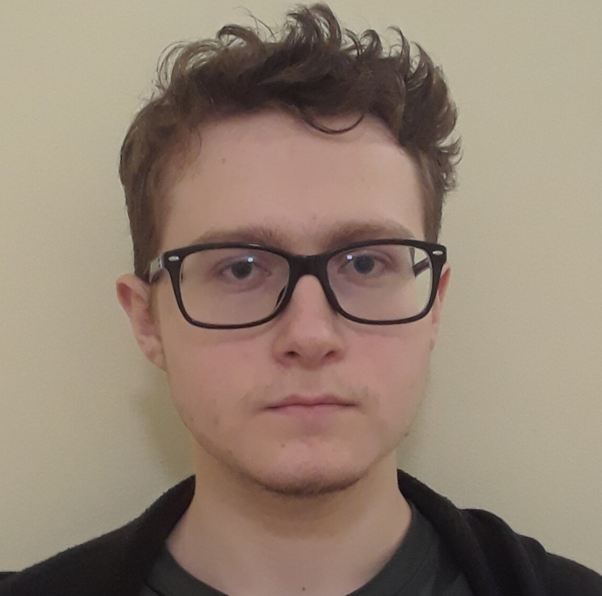

# David Barsamyan

- Computer Science Specialist
- Software Developer
- davit.barsamyan@mail.utoronto.ca

## Links

- [GitHub](https://github.com/Barsamyan-D)
- [LinkedIn](https://www.linkedin.com/in/david-barsamyan-213a75265/)

## About David

David is a final year Computer Science Specialist undergrad at UofT. He moved from Armenia to Canada when he was 3. He has previous research and work experience in full-stack software development. He enjoys playing chess and reading classic novels in his spare time, and also pursues video game development as a hobby.

## Strengths

- Attentive to details
- Clear and effective communicator
- Strong organizational skills
  
## Weaknesses

- Incapable of multitasking
- Can get caught up in less important details
- Sometimes hesitant to delegate work
